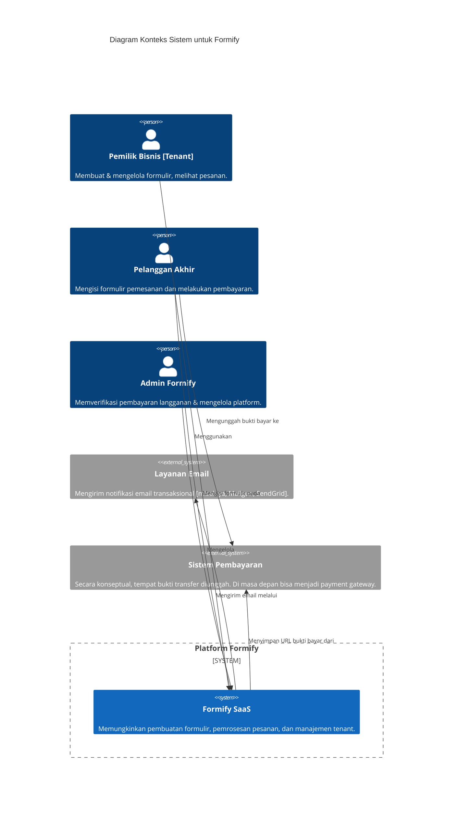

# Dokumen Perancangan Arsitektur Teknis: Platform SaaS 'Formify'

Dokumen ini merinci arsitektur teknis untuk platform SaaS 'Formify', sebuah solusi bagi UMKM dan bisnis digital untuk membuat dan mengelola formulir pemesanan.

## 1. Prinsip Arsitektur & Tujuan Utama

*   **Scalability & Performance:** Arsitektur harus mampu menangani peningkatan jumlah tenant dan volume pesanan tanpa degradasi performa.
*   **Security by Design:** Keamanan data tenant dan pelanggan akhir adalah prioritas utama, diimplementasikan di setiap lapisan aplikasi.
*   **Maintainability & Developer Experience (DX):** Kode harus terstruktur dengan baik, mudah diuji, dan dapat dikelola oleh tim pengembang.
*   **Resilience & Availability:** Sistem harus dirancang untuk meminimalkan downtime dan memiliki mekanisme pemulihan yang jelas.

## 2. Diagram Arsitektur

### 2.1. Diagram Konteks Sistem (C4 Level 1)



### 2.2. Diagram Kontainer (C4 Level 2)

```mermaid
C4Container
    title Diagram Kontainer untuk Platform Formify

    Person(owner, "Pemilik Bisnis [Tenant]", "Menggunakan browser web")
    Person(customer, "Pelanggan Akhir", "Menggunakan browser web atau perangkat seluler")
    Person(admin, "Admin Formify", "Menggunakan browser web")

    System_Ext(email_service, "Layanan Email", "API untuk mengirim email")

    System_Boundary(formify_boundary, "Platform Formify") {
        Container(web_app, "Aplikasi Web [Laravel]", "Menyajikan dashboard tenant, form builder [Livewire], dan API. Titik masuk utama.")
        Container(public_api, "API Publik [Laravel]", "Endpoint untuk penyajian & pengiriman formulir. Dioptimalkan untuk kecepatan & keamanan.")
        Container(embed_script, "Skrip Sematan [JS]", "JavaScript vanilla yang dirender di situs klien untuk menampilkan formulir.")
        
        ContainerDb(database, "Database [PostgreSQL]", "Menyimpan semua data: tenant, formulir, pesanan, langganan.")
        ContainerDb(cache, "Cache & Antrian [Redis]", "Menyimpan cache sesi, aplikasi, dan sebagai broker untuk tugas latar belakang.")
        Container(worker, "Worker Antrian [PHP]", "Memproses tugas asinkron seperti mengirim email dan notifikasi.")
    }

    ' Interaksi Pengguna
    Rel(owner, web_app, "Mengelola formulir & pesanan via HTTPS")
    Rel(admin, web_app, "Mengelola platform via HTTPS")
    Rel(customer, embed_script, "Memuat di browser mereka")
    Rel(embed_script, public_api, "Mengambil konfigurasi formulir via HTTPS/JSON")
    Rel(customer, public_api, "Mengirimkan data formulir via HTTPS/JSON")

    ' Interaksi Internal
    Rel(web_app, database, "Membaca/Menulis data", "JDBC")
    Rel(web_app, cache, "Menyimpan & membaca sesi/cache")
    Rel(web_app, cache, "Mendorong pekerjaan ke antrian")
    
    Rel(public_api, database, "Membaca konfigurasi & menulis pesanan", "JDBC")
    Rel(public_api, cache, "Mendorong pekerjaan ke antrian")

    Rel(worker, database, "Membaca data & memperbarui status", "JDBC")
    Rel(worker, cache, "Mengambil pekerjaan dari antrian")
    Rel(worker, email_service, "Mengirim email", "API Call")
```

## 3. Tumpukan Teknologi & Justifikasi

*   **Backend Framework:** Laravel 12.
    *   **Justifikasi:** Ekosistem yang matang, keamanan bawaan yang kuat (ORM dengan proteksi Mass Assignment, CSRF protection), dukungan komunitas yang luas, dan fitur-fitur seperti Queues, Events, dan Task Scheduling yang sangat cocok untuk aplikasi SaaS.
*   **Frontend Scaffolding & Interactivity:** Laravel Jetstream dengan tumpukan Livewire.
    *   **Justifikasi:** Memungkinkan pengembangan antarmuka dinamis dan reaktif dengan cepat tanpa memerlukan API terpisah atau konteks JavaScript yang kompleks. Ideal untuk dashboard admin dan form builder. Fitur 'Teams' bawaan menjadi fondasi yang kokoh untuk implementasi multi-tenancy.
*   **Database:** PostgreSQL 15.
    *   **Justifikasi:** Dukungan superior untuk tipe data JSONB (krusial untuk `config` dan `styles` formulir yang fleksibel), performa yang andal pada beban kerja baca/tulis yang tinggi, dan fitur-fitur lanjutan seperti indexing yang lebih kaya.
*   **Cache & Queue Broker:** Redis.
    *   **Justifikasi:** Performa in-memory yang sangat cepat untuk caching (konfigurasi, rute, view) dan sebagai message broker yang andal untuk Laravel Queues (pemrosesan tugas latar belakang seperti pengiriman email dan notifikasi).
*   **Server & Deployment:** Nginx, PHP-FPM, Supervisor.
    *   **Justifikasi:** Konfigurasi standar industri yang terbukti andal dan berkinerja tinggi untuk aplikasi PHP. Supervisor memastikan proses antrian (queue workers) tetap berjalan.

## 4. Arsitektur Multi-Tenancy (Deep Dive)

*   **Pendekatan:** Single-Database, Multi-Tenant dengan Diskriminator Kolom (`team_id`).
*   **Isolasi Data:** Setiap tabel yang berisi data spesifik tenant (misalnya, `forms`, `orders`, `subscriptions`) wajib memiliki kolom `team_id` yang diindeks. Global Scopes di Laravel akan digunakan untuk secara otomatis menerapkan klausa `WHERE team_id = ?` pada semua query, mencegah kebocoran data antar-tenant.
*   **Manajemen Tim & Peran:** Memanfaatkan Laravel Jetstream Teams sebagai dasar.
    *   **Roles:** `Owner`, `Admin`, `Editor`.
    *   **Permissions:** Didefinisikan menggunakan Laravel Gates/Policies untuk setiap peran (mis. `view-dashboard`, `create-form`, `manage-billing`, `delete-order`).
*   **Mitigasi Risiko Kinerja:** Strategi indexing yang cermat pada kolom `team_id` dan kolom lain yang sering di-query (seperti `uuid` pada `forms` dan `orders`) untuk memastikan performa tetap terjaga seiring bertambahnya jumlah tenant.

## 5. Skema Database Rinci & Rasionalisasi

*   `users`, `teams`, `team_user`: Tabel standar dari Jetstream.
*   `subscriptions`: `id`, `team_id` (indexed), `plan_id`, `status`, `starts_at`, `ends_at`, `payment_proof_url`, `verified_by`.
*   `plans`: `id`, `name`, `price_monthly`, `features` (json).
*   `forms`: `id`, `uuid` (unique, indexed), `team_id` (indexed), `name`, `slug` (unique per team), `config` (jsonb), `styles` (jsonb), `is_active`, `submission_count_this_month`.
*   `orders`: `id`, `uuid` (unique, indexed), `form_id` (indexed), `team_id` (indexed), `customer_data` (jsonb), `order_items` (jsonb), `total_amount`, `currency`, `status`, `proof_of_payment_url`, `payment_deadline`.
*   `activity_logs`: `id`, `user_id`, `team_id`, `action`, `details` (jsonb).

## 6. Alur Kerja Kunci & Proses Asinkron

*   **Onboarding & Upgrade Langganan:** (Pengguna mendaftar -> `subscription` 'Free' -> Upgrade -> Upload bukti -> Verifikasi Admin -> Event `SubscriptionActivated` -> Kirim email via Queue).
*   **Pembuatan & Penyematan Formulir:** (Buat di Dashboard -> Validasi batasan paket -> Simpan & generate `uuid` -> Sediakan embed script).
*   **Proses Pemesanan oleh End-Customer:** (Embed script `GET /api/v1/forms/{uuid}` -> Render form -> `POST /api/v1/forms/{uuid}/submit` -> Validasi & buat `order` -> Event `OrderReceived` -> Kirim notifikasi & update counter via Queue).
*   **Reset Batasan Bulanan:** (Laravel Task Scheduler berjalan setiap awal bulan untuk mereset `submission_count_this_month`).

## 7. Arsitektur Frontend & Pengalaman Pengguna (UX)

*   **Dashboard Tenant:** Komponen Livewire stateful untuk interaksi dinamis tanpa reload.
*   **Form Builder:** Komponen Livewire kompleks dengan integrasi Alpine.js untuk drag-and-drop.
*   **Skrip Sematan (Embed Script):** JavaScript vanilla yang ringan, dimuat secara `async defer`, membuat `iframe`, dan berkomunikasi dengan API publik Formify. Keamanan dijamin dengan `CORS`.

## 8. API & Keamanan

*   **API Publik (Tanpa Autentikasi):**
    *   `GET /api/v1/forms/{uuid}`: Rate Limiting ketat.
    *   `POST /api/v1/forms/{uuid}/submit`: Rate Limiting, Honeypot/CAPTCHA.
*   **API Internal (Terautentikasi):**
    *   Menggunakan Laravel Sanctum. Semua endpoint di-scope ke `team_id` pengguna.
*   **Keamanan Tambahan:** Validasi Input, Proteksi Mass Assignment, Secure File Uploads, Enkripsi Data Sensitif, Header Keamanan (CSP, HSTS).

## 9. Skalabilitas, Ketersediaan & DevOps

*   **Infrastruktur:** Docker containers (Nginx, PHP-FPM, Redis, PostgreSQL, Worker) diorkestrasi dengan Docker Compose (dev) dan Kubernetes (prod).
*   **Pemisahan Beban Kerja:** Server/container terpisah untuk Web, DB, dan Queue.
*   **CI/CD Pipeline:** GitHub Actions (Tests -> Static Analysis -> Build -> Deploy).
*   **Zero-Downtime Deployment:** Strategi Blue-Green atau menggunakan Laravel Envoyer.
*   **Caching Strategy:** CDN/Edge (API publik) & Redis (Aplikasi).

## 10. Observabilitas & Pemantauan

*   **Logging:** Logging terstruktur (JSON) ke agregator terpusat (ELK, Papertrail).
*   **Error Tracking:** Integrasi dengan Sentry atau Flare.
*   **Performance Monitoring (APM):** Laravel Telescope (lokal), New Relic/Datadog (produksi).
*   **Health Checks:** Endpoint `/up` untuk load balancer.