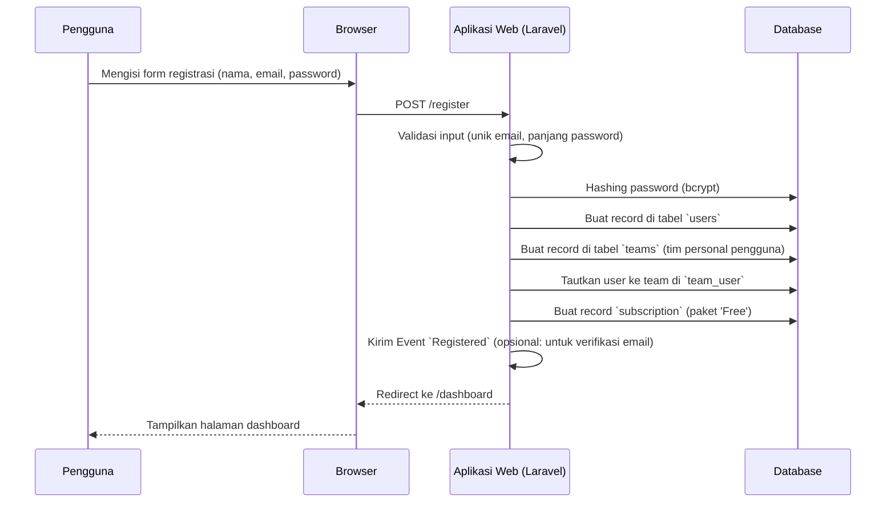
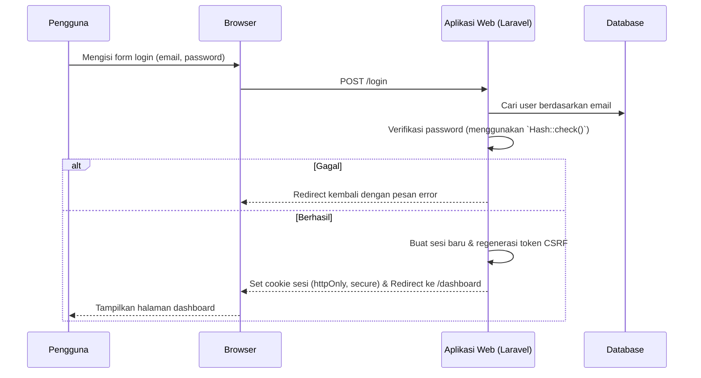
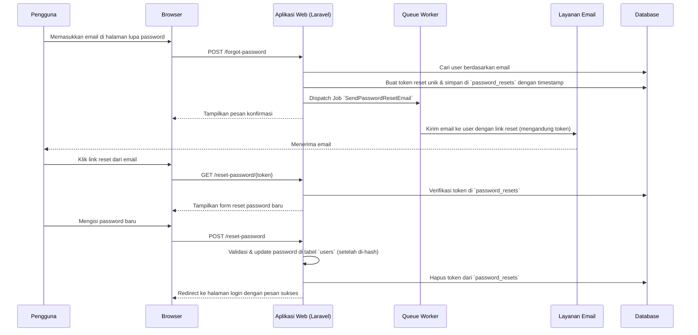

# Rencana Implementasi Autentikasi & Otorisasi untuk Formify

Dokumen ini merinci rencana teknis untuk mengimplementasikan sistem autentikasi dan otorisasi yang aman, skalabel, dan terintegrasi untuk platform Formify, berdasarkan `ARCHITECTURE.md`.

## 1. Strategi Autentikasi

Berdasarkan arsitektur yang ada (Laravel, Jetstream), strategi autentikasi yang direkomendasikan adalah pendekatan hibrida untuk melayani berbagai jenis pengguna (Tenant, Admin, Pelanggan Akhir).

*   **Email & Password (Utama):**
    *   **Target:** Pemilik Bisnis (Tenant) dan Admin Formify.
    *   **Justifikasi:** Ini adalah metode standar industri, aman, dan didukung penuh oleh **Laravel Jetstream**. Ini memberikan kontrol penuh kepada pengguna atas akun mereka dan selaras dengan alur kerja B2B.
*   **Login Sosial (Google & Telegram - Fase Berikutnya):**
    *   **Target:** Pemilik Bisnis (Tenant).
    *   **Justifikasi:** Menyediakan alur registrasi dan login yang lebih cepat dan nyaman, yang dapat meningkatkan konversi. Implementasi ini dapat ditambahkan dengan mudah menggunakan **Laravel Socialite** setelah fondasi utama selesai.
*   **Magic Link (Opsional - Fase Berikutnya):**
    *   **Target:** Pelanggan Akhir (jika diperlukan di masa depan).
    *   **Justifikasi:** Untuk skenario di mana pelanggan akhir mungkin perlu mengakses riwayat pesanan mereka tanpa membuat akun penuh. Ini adalah metode tanpa kata sandi yang mengurangi friksi.

**Prioritas Implementasi:** Fokus utama saat ini adalah **Email & Password** yang merupakan inti dari fungsionalitas Jetstream.

## 2. Model Otorisasi

Model yang paling sesuai adalah **Role-Based Access Control (RBAC)**, yang sudah diinisiasi dalam `ARCHITECTURE.md` melalui Jetstream Teams.

*   **Definisi Peran (Roles):**
    *   **Platform-Level:**
        *   `Super Admin`: Akses penuh ke seluruh platform, termasuk manajemen tenant dan verifikasi langganan.
    *   **Team-Level (Tenant):**
        *   `Owner`: Hak penuh atas satu tim (tenant). Dapat mengelola langganan, mengundang anggota, dan memiliki semua izin di bawahnya.
        *   `Admin`: Dapat mengelola formulir, pesanan, dan anggota tim, tetapi tidak dapat mengelola langganan atau menghapus tim.
        *   `Editor`: Hanya dapat melihat dan mengelola pesanan dari formulir yang ditugaskan kepadanya.
*   **Manajemen Izin (Permissions):**
    *   Izin akan didefinisikan secara eksplisit menggunakan **Laravel Gates & Policies**. Ini memungkinkan logika otorisasi yang terperinci dan mudah diuji.
    *   Contoh Izin: `view-dashboard`, `create-form`, `edit-form`, `delete-form`, `view-orders`, `manage-billing`, `invite-team-member`.
*   **Implementasi Teknis:**
    1.  Manfaatkan fungsionalitas `Jetstream::role()` dan `Jetstream::permission()` di `AppServiceProvider`.
    2.  Buat file `Policy` untuk setiap model yang relevan (misalnya, `FormPolicy`, `OrderPolicy`).
    3.  Gunakan middleware `can:` di rute dan direktif `@can` di view Livewire untuk menegakkan aturan.

## 3. Manajemen Sesi

Pendekatan yang direkomendasikan adalah menggunakan **sesi berbasis cookie yang aman**, yang dikelola oleh Laravel Sanctum, selaras dengan arsitektur yang ada.

*   **Metode:** Sesi Stateful dengan Laravel Sanctum untuk SPA.
    *   **Justifikasi:** Karena frontend dashboard adalah *stateful* (dibangun dengan Livewire), pendekatan ini lebih sederhana dan lebih aman daripada mengelola JWT secara manual di sisi klien. Laravel secara otomatis menangani regenerasi token, proteksi CSRF, dan pengiriman cookie.
*   **Penyimpanan Token:**
    *   Token sesi akan disimpan dalam **Cookie `httpOnly`, `secure`, dan `SameSite=lax`**.
    *   **`httpOnly`:** Mencegah akses token melalui JavaScript, mengurangi risiko serangan XSS.
    *   **`secure`:** Memastikan cookie hanya dikirim melalui koneksi HTTPS.
    *   **`SameSite=lax`:** Memberikan perlindungan terhadap serangan CSRF.
*   **API Publik:** Untuk API publik (`/api/v1/forms/...`) yang diakses oleh skrip sematan, tidak ada sesi yang diperlukan. Namun, untuk API yang mungkin memerlukan autentikasi di masa depan (misalnya, untuk pelanggan akhir), **Laravel Sanctum API Tokens** dapat digunakan.

## 4. Alur Pengguna Kunci (Key User Flows)

Berikut adalah uraian teknis untuk alur-alur penting.

### 4.1. Alur Registrasi Tenant



### 4.2. Alur Login Tenant



### 4.3. Alur Lupa Password



## 5. Rekomendasi Teknologi dan Pustaka

Tumpukan teknologi yang ada sudah sangat memadai. Berikut adalah penegasan dan beberapa tambahan kecil:

*   **Framework Inti:** **Laravel 12** & **Laravel Jetstream (Livewire Stack)** - Tetap menjadi fondasi utama.
*   **Hashing Password:** **Bcrypt** (bawaan Laravel) - Standar industri yang kuat. Tidak perlu diubah.
*   **Otorisasi:** **Laravel Gates & Policies** (bawaan Laravel) - Sesuai untuk RBAC yang terperinci.
*   **Login Sosial:** **Laravel Socialite** - Pustaka resmi Laravel untuk integrasi OAuth dengan provider seperti Google, GitHub, dll.
*   **Rate Limiting:** **Firewall (Fail2Ban)** di level server dan **Laravel Rate Limiter** (bawaan) di level aplikasi.

## 6. Desain Skema Database

Skema yang ada di `ARCHITECTURE.md` sudah cukup baik. Berikut adalah penambahan dan penyesuaian untuk mendukung sistem auth yang lebih kuat.

```sql
-- Tabel standar dari Laravel & Jetstream
CREATE TABLE "users" (
  "id" bigserial PRIMARY KEY,
  "name" varchar(255) NOT NULL,
  "email" varchar(255) UNIQUE NOT NULL,
  "email_verified_at" timestamp NULL,
  "password" varchar(255) NOT NULL,
  "remember_token" varchar(100) NULL,
  "current_team_id" bigint NULL,
  "profile_photo_path" text NULL,
  "created_at" timestamp NOT NULL,
  "updated_at" timestamp NOT NULL
);

CREATE TABLE "teams" (
  "id" bigserial PRIMARY KEY,
  "user_id" bigint NOT NULL,
  "name" varchar(255) NOT NULL,
  "personal_team" boolean NOT NULL,
  "created_at" timestamp NOT NULL,
  "updated_at" timestamp NOT NULL
);

CREATE TABLE "team_user" (
  "id" bigserial PRIMARY KEY,
  "team_id" bigint NOT NULL,
  "user_id" bigint NOT NULL,
  "role" varchar(255) NULL, -- 'admin', 'editor'
  "created_at" timestamp NOT NULL,
  "updated_at" timestamp NOT NULL,
  UNIQUE("team_id", "user_id")
);

-- Tabel untuk reset password (standar Laravel)
CREATE TABLE "password_reset_tokens" (
  "email" varchar(255) PRIMARY KEY,
  "token" varchar(255) NOT NULL,
  "created_at" timestamp NULL
);

-- Tabel untuk melacak aktivitas login (keamanan tambahan)
CREATE TABLE "login_activities" (
  "id" bigserial PRIMARY KEY,
  "user_id" bigint NOT NULL,
  "ip_address" varchar(45) NOT NULL,
  "user_agent" text NOT NULL,
  "login_at" timestamp NOT NULL,
  "logout_at" timestamp NULL
);

ALTER TABLE "login_activities" ADD FOREIGN KEY ("user_id") REFERENCES "users" ("id") ON DELETE CASCADE;
```

## 7. Definisi Endpoint API

Endpoint akan dibagi menjadi dua grup: rute web untuk interaksi browser dan rute API untuk klien eksternal (jika ada di masa depan).

### Rute Web (Terproteksi oleh `web` middleware group: CSRF, Cookies)

*   `GET /register`: Menampilkan halaman registrasi.
*   `POST /register`: Memproses registrasi pengguna baru.
*   `GET /login`: Menampilkan halaman login.
*   `POST /login`: Memproses upaya login.
*   `POST /logout`: Mengakhiri sesi pengguna.
*   `GET /forgot-password`: Menampilkan halaman permintaan reset password.
*   `POST /forgot-password`: Mengirim email reset password.
*   `GET /reset-password/{token}`: Menampilkan halaman untuk memasukkan password baru.
*   `POST /reset-password`: Memproses perubahan password.
*   `GET /user/profile`: Halaman profil pengguna (bawaan Jetstream).
*   `GET /teams/{team}`: Halaman manajemen tim (bawaan Jetstream).

### Rute API (Terproteksi oleh `auth:sanctum` middleware)

*   `GET /api/user`: Mengambil data pengguna yang sedang terautentikasi.
*   `POST /api/auth/token`: (Opsional) Endpoint untuk mengeluarkan token API jika diperlukan klien pihak ketiga.

## 8. Pertimbangan Keamanan (Checklist)

Ini adalah daftar periksa praktik keamanan yang wajib diimplementasikan.

*   [x] **Password Hashing:** Gunakan `bcrypt` dengan *cost factor* yang wajar (Laravel default).
*   [x] **Proteksi Brute-Force:** Terapkan *rate limiting* pada endpoint `POST /login` dan `POST /forgot-password` menggunakan `throttle` middleware.
*   [x] **Proteksi CSRF:** Pastikan semua rute `POST`, `PUT`, `PATCH`, `DELETE` dalam grup `web` dilindungi oleh middleware `VerifyCsrfToken`. Jetstream sudah menangani ini.
*   [x] **Validasi Input:** Validasi semua input dari pengguna secara ketat di sisi server menggunakan `Laravel Validation`.
*   [x] **Verifikasi Email:** Wajibkan verifikasi email untuk semua akun baru untuk mencegah pendaftaran spam. Gunakan fitur bawaan Laravel.
*   [x] **Pengaturan Cookie Aman:** Pastikan cookie sesi diatur dengan flag `HttpOnly`, `Secure` (di produksi), dan `SameSite=Lax`.
*   [x] **Proteksi Mass Assignment:** Gunakan properti `$fillable` atau `$guarded` pada semua model Eloquent.
*   [ ] **Audit Trail:** Implementasikan tabel `login_activities` untuk mencatat upaya login (berhasil dan gagal) untuk analisis keamanan.
*   [ ] **Notifikasi Perubahan Keamanan:** Kirim email notifikasi kepada pengguna ketika ada perubahan sensitif pada akun mereka (misalnya, perubahan password atau email).
*   [ ] **Analisis Ketergantungan:** Secara berkala periksa ketergantungan (via `composer audit`) untuk kerentanan yang diketahui.